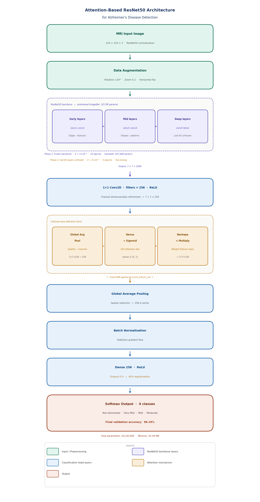
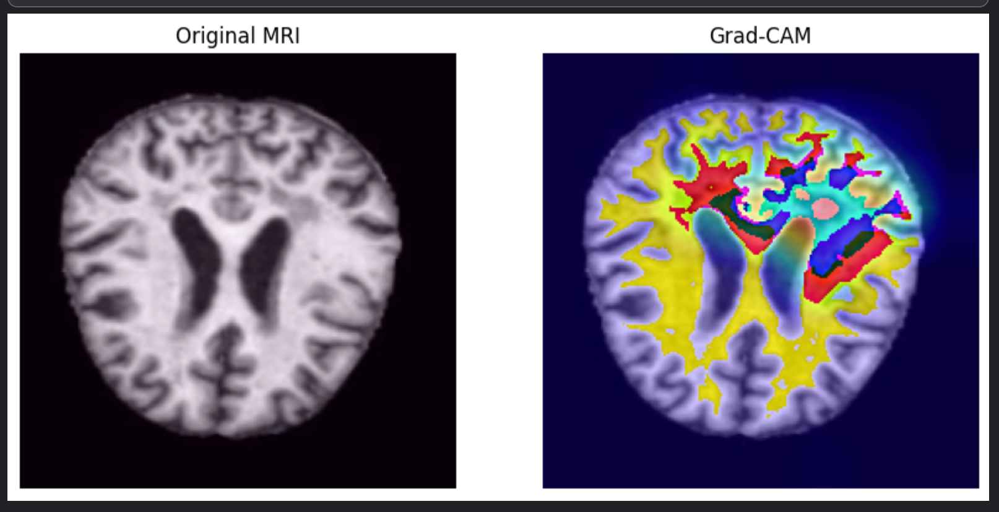

# 🧠 Alzheimer’s Disease Detection using Deep Learning

🚀 **Achieved 96.1% accuracy with explainable AI (Grad-CAM)**

---

## 📌 Overview

This project focuses on **early detection of Alzheimer’s Disease** using MRI brain images.
It combines **deep learning performance with interpretability**, addressing a key limitation of medical AI systems.

The proposed model integrates:

* **ResNet50 (Transfer Learning)**
* **Attention Mechanism**
* **Grad-CAM (Explainable AI)**

---

## 🧠 Model Architecture

The pipeline:

MRI Image → ResNet50 → Attention → Dense Layers → Prediction → Grad-CAM

### 📊 Architecture Diagram


---

## 🚀 Key Features

* 🔥 Attention-enhanced ResNet50 model
* 🔥 Two-phase training (freeze + fine-tuning)
* 🔥 Multi-class classification (4 Alzheimer stages)
* 🔥 Explainable AI using Grad-CAM
* 🔥 High performance with real-world relevance

---

## 📊 Dataset
[(Dataset)](https://drive.google.com/file/d/1jVKENvRj5N7DLR3nR9tXACaNTOuz_uxl/view?usp=drive_link)

* **Source:** Kaggle Alzheimer MRI Dataset

* **Type:** 2D MRI images

* **Classes:**

  * Non-Demented
  * Very Mild Demented
  * Mild Demented
  * Moderate Demented

* **Preprocessing:**

  * Resized to 224×224
  * Normalization (ResNet50 preprocessing)
  * Data augmentation (rotation, zoom, flip, brightness)

---

## ⚙️ Training Strategy

### 🔹 Phase 1 — Transfer Learning

* ResNet50 layers frozen
* Train custom layers

### 🔹 Phase 2 — Fine-Tuning

* Last layers unfrozen
* Lower learning rate applied

---

## 📈 Results

| Model              | Accuracy  |
| ------------------ | --------- |
| CNN                | ~74%      |
| ResNet50           | ~85%      |
| **Proposed Model** | **96.1%** |

---

## 🔍 Explainability (Grad-CAM)

Grad-CAM provides visual explanations by highlighting important regions used for prediction.

### 🧠 Example Output


👉 The model focuses on:

* Ventricles
* Cortical regions

These are clinically relevant for Alzheimer’s diagnosis.

---

## 🛠️ Tech Stack

* Python
* TensorFlow / Keras
* OpenCV
* NumPy
* Matplotlib

---

## 📂 Project Structure

```
Alzheimer-Detection-Using-Deep-Learning/
│
├── images/
│   ├── architecture.png
│   ├── gradcam.png
│
├── notebooks/
│   └── training_notebook.ipynb
│
└── README.md
```

---

## 🎯 Key Contributions

* ✔ Developed attention-based ResNet50 model
* ✔ Achieved **96.1% classification accuracy**
* ✔ Integrated Grad-CAM for interpretability
* ✔ Solved accuracy + explainability gap

---

## ⚠️ Limitations

* Requires GPU for training
* Limited dataset size
* Uses 2D MRI (not full 3D volume)

---

## 🚀 Future Work

* 3D CNN for volumetric MRI
* Multimodal learning (MRI + PET)
* Vision Transformers (ViT)
* Advanced explainability (SHAP, LIME)

---

## 👨‍💻 Author

**Varun Vijaya Babu**
📧 [vv5527@srmist.edu.in](mailto:vv5527@srmist.edu.in)

---

⭐ If you found this useful, consider giving this repo a star!
